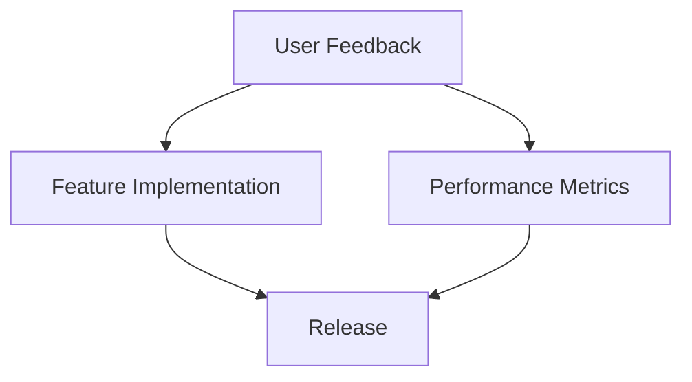

# Routine BRD v3.2 Extended

## Introduction
This document provides an extensive overview and specifications for the Routine BRD version 3.2. It aims to streamline the existing processes and incorporate user feedback to enhance the overall functionality and productivity.

## Table of Contents
1. [Overview](#overview)
2. [Goals and Objectives](#goals-and-objectives)
3. [Detailed Specifications](#detailed-specifications)
   - [Subsection A: Feature Overview](#subsection-a-feature-overview)
   - [Subsection B: Technical Requirements](#subsection-b-technical-requirements)
4. [User Stories](#user-stories)
5. [Visuals and Screenshots](#visuals-and-screenshots)
6. [Conclusion](#conclusion)
7. [Appendix](#appendix)

## 1. Overview
This document outlines the planned features and their benefits to users, targeting specific pain points identified in previous versions.

## 2. Goals and Objectives
- Improve user engagement through enhanced features.
- Streamline the onboarding process for new users.
- Incorporate user feedback into the development cycle.

## 3. Detailed Specifications
### Subsection A: Feature Overview
- Overview of each feature planned for release in version 3.2.

### Subsection B: Technical Requirements
- Specific requirements for implementation, including software and hardware needs.

## 4. User Stories
- Describe scenarios from a user perspective illustrating the anticipated usage of the new features.

## 5. Visuals and Screenshots
- Placeholder for visuals and screenshots to be included in the final document.

## 6. Conclusion
Summarize the importance of these enhancements for the user experience and overall system improvement.

## 7. Appendix
Additional resources, links, and documentation relevant to the Routine BRD.

---