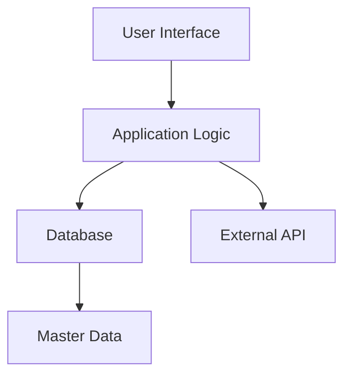

# Business Requirements Document  - Routine_BRD_v3.2_Professional

## Executive Summary  
This Business Requirements Document outlines the essential requirements for the development and implementation of the routine management system. The purpose of this document is to capture the needs of stakeholders, define the scope of the project, and serve as a guideline for the project team.  

### Project Overview  
The routine management system aims to streamline various operational processes, enhance data management, and improve efficiency within the organization. This document specifies the modules, functionalities, and requirements needed to achieve successful implementation.

## Architecture Diagrams
Below is the system architecture visualized using Mermaid syntax:

## Master Data Tables  
This section outlines the key master data tables essential for the application:

| Table Name          | Description                          |
|---------------------|--------------------------------------|
| Users              | Stores user information              |
| Roles              | Defines user roles and permissions   |
| Settings           | Configuration settings for the app  |
| Logs               | Tracks application logs              |

## Modules Overview  
### User Management Module  
This module handles all user-related functionalities such as registration, authentication, and profile management.  

### Data Management Module  
Manages all CRUD operations related to master data entries.  

### Reporting Module  
Generates various reports based on user interactions and data metrics.

## Acceptance Criteria  
- Users can register an account successfully.
- Users can log in and access their profiles.
- The application responds within 2 seconds for data retrieval operations.

## Non-Functional Requirements  
- The system should handle at least 1000 concurrent users.
- Data encryption must be applied for all sensitive information.

## Future Roadmap  
1. Phase 1: Basic functionality release (Q2 2026)  
2. Phase 2: Enhanced reporting features (Q4 2026)  
3. Phase 3: Integration with external systems (2027)  

## Professional UI Placeholders  
- **Login Form**: Username, Password fields, Submit button.
- **Dashboard**: Overview of system metrics with graphs.
- **User Profiles**: Editable form with user information fields.

---  
This document is intended for stakeholders and project teams to ensure all requirements are captured clearly and comprehensively.