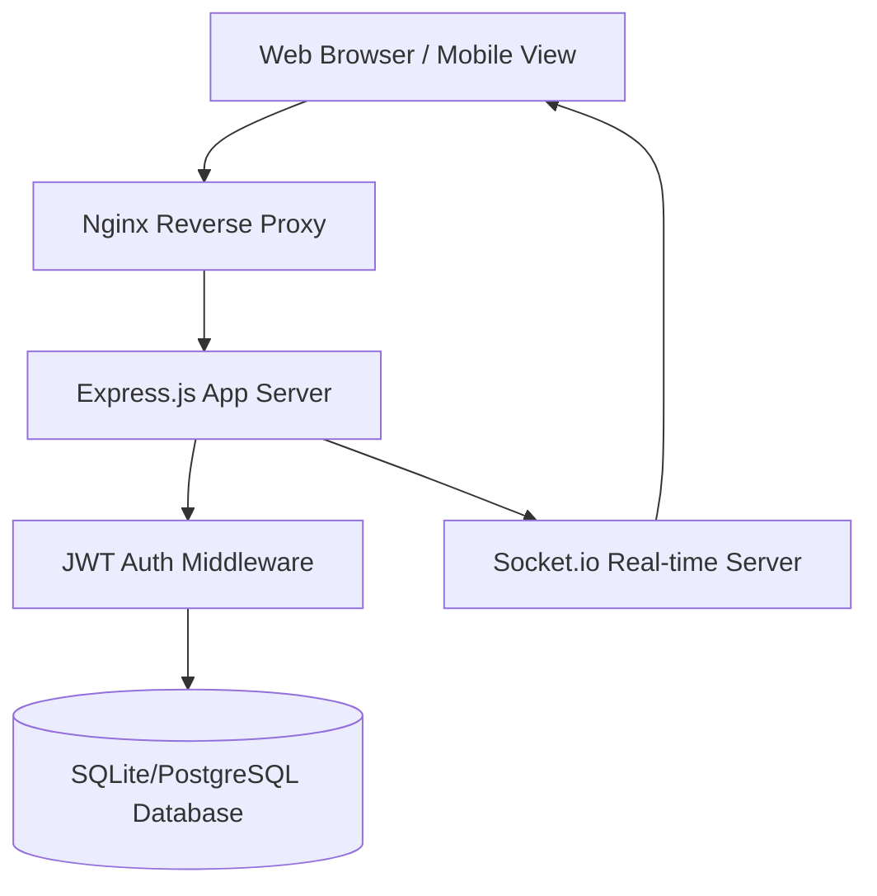
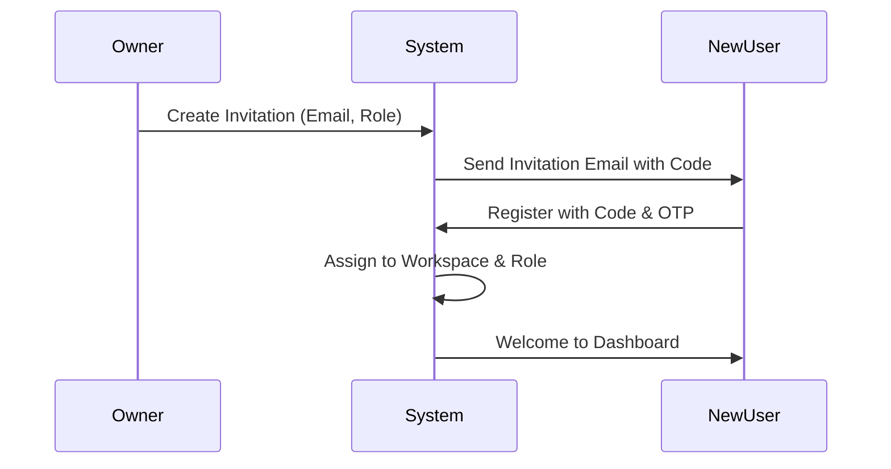
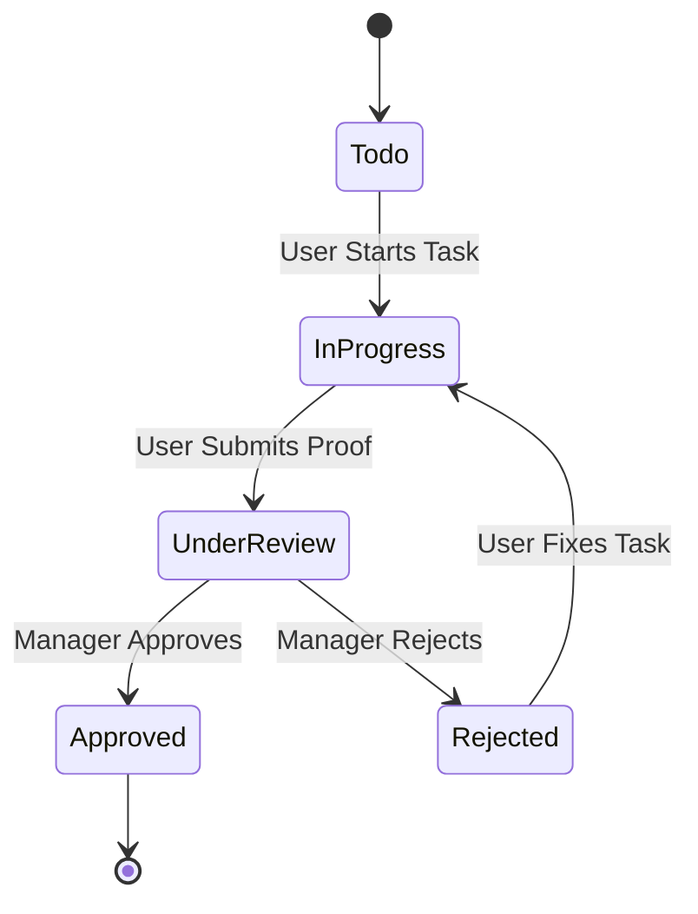

# Business Requirements Document (BRD) - Routine App

**Project Name:** Routine - Enterprise Task & Workflow Management System  
**Version:** 1.0.0  
**Date:** March 25, 2026  
**Status:** Draft  
**Author:** AI Studio Build Agent  

---

## 1. Executive Summary
Routine is a comprehensive, multi-tenant enterprise application designed to streamline business operations through structured task management, real-time collaboration, and automated workflows. The platform bridges the gap between high-level project planning and ground-level execution by introducing strict verification and approval mechanisms.

### 1.1 Problem Statement
Many businesses struggle with:
*   Lack of visibility into daily operational tasks.
*   Inconsistent quality of task execution.
*   Fragmented communication across multiple tools.
*   Difficulty in managing multi-branch or multi-departmental operations.

### 1.2 Proposed Solution
Routine provides a unified workspace where:
*   Owners can manage multiple business branches (Workspaces).
*   Managers can enforce quality through "Proof of Work" requirements.
*   Teams can communicate in context via integrated chat.
*   Automations handle repetitive status updates and notifications.

---

## 2. Project Overview
### 2.1 Project Scope
The scope includes the development of a web-based platform supporting:
*   Multi-workspace architecture.
*   Granular Role-Based Access Control (RBAC).
*   Kanban-based project and task management.
*   Verification and Approval workflows.
*   Internal messaging (Direct & Group).
*   Reporting and Activity auditing.

### 2.2 Target Audience
*   **Business Owners:** Managing multiple branches/entities.
*   **Admins/HR:** Managing users, roles, and organizational structure.
*   **Department Managers:** Overseeing specific team outputs and quality.
*   **Employees:** Executing daily tasks and providing proof of completion.

---

## 3. Business Objectives
1.  **Centralization:** Reduce tool sprawl by consolidating tasks, chat, and approvals.
2.  **Accountability:** Ensure 100% task verification through mandatory photo/video/document proof.
3.  **Scalability:** Enable businesses to add new workspaces and departments seamlessly.
4.  **Efficiency:** Automate routine notifications and status transitions.
5.  **Competitive Moat (Zero-Friction Input):** Establish a unique market position by offering a WhatsApp-native task creation layer, meeting floor staff where they already are without forcing new app adoption.

---

## 4. Stakeholders
| Stakeholder | Role | Responsibility |
| :--- | :--- | :--- |
| Business Owner | Primary User | Strategic oversight, workspace creation, billing. |
| Workspace Admin | Secondary User | User onboarding, role configuration, system settings. |
| Department Manager | Operational User | Task assignment, quality verification, reporting. |
| Team Member | End User | Task execution, proof submission, daily updates. |

---

## 5. Functional Requirements

### 5.1 Workspace Management (WSM)
*   **WSM-01:** System shall support multiple isolated workspaces under one owner account.
*   **WSM-02:** Owners shall be able to switch between workspaces without re-logging.
*   **WSM-03:** Each workspace shall have independent settings, users, and data.

### 5.2 User & Role Management (URM)
*   **URM-01:** Support for 4 system roles: Owner, Admin, Manager, Employee.
*   **URM-02:** Ability to create custom roles within departments with specific permission sets.
*   **URM-03:** Invitation-based onboarding via email/code.
*   **URM-04:** OTP-based secure login for mobile users.

### 5.3 Project & Task Management (PTM)
*   **PTM-01:** Kanban board visualization with customizable columns per project.
*   **PTM-02:** Task attributes: Priority, Due Date/Time, Assignee (User/Role/Dept).
*   **PTM-03:** Support for recurring tasks (Daily, Weekly, Monthly) via RRULE.
*   **PTM-04:** Checklist and subtask support within individual tasks.

### 5.4 Verification & Approvals (VAA)
*   **VAA-01:** Mandatory "Proof of Work" (Image, Video, Document) for specific tasks.
*   **VAA-02:** Multi-stage approval workflow (Pending -> Under Review -> Approved/Rejected).
*   **VAA-03:** Rejection remarks and re-assignment logic.

### 5.5 Communication (COM)
*   **COM-01:** Real-time direct messaging between users.
*   **COM-02:** Group chat functionality for departments or projects.
*   **COM-03:** File attachments in chat messages.

### 5.6 Automation & Workflows (AWF)
*   **AWF-01:** Trigger-Action engine (e.g., If Task Status = Done, Then Notify Manager).
*   **AWF-02:** Automated reminders for overdue tasks.

### 5.7 Omnichannel Input (OMI)
*   **OMI-01:** System shall support a "zero-friction input layer" allowing users to create tasks via external channels without opening the Routine app.
*   **OMI-02:** **WhatsApp Integration:** Support task creation via WhatsApp Business API. Users can text a dedicated "Routine Bot" persona (e.g., "Restock dairy section by 5pm, assign to Ravi").
*   **OMI-03:** **AI Parsing:** Routine's AI (Gemini) shall parse natural language inputs from WhatsApp or voice memos into structured task fields (title, assignee, due time).
*   **OMI-04:** **Confirmation Flow:** The Routine Bot shall send a WhatsApp confirmation card with quick-reply buttons (Confirm / Edit / Cancel) before finalizing task creation.
*   **OMI-05:** **Share Sheet Extension:** Support iOS and Android Share Sheet extensions, allowing users to share text from Notes apps or transcribed voice memos directly to Routine as draft tasks.
*   **OMI-06:** **Guardrails & Fallbacks:**
    *   Ambiguous messages shall trigger a clarifying WhatsApp reply from the bot before task creation.
    *   Tasks parsed as high priority shall always require in-app confirmation from a manager.
    *   The Routine Bot shall automatically reply in the same language the user used in their message.
*   **OMI-07:** **System of Record:** While input can occur via omnichannel sources (WhatsApp, Share Sheet), all task approvals, history, and dashboard context shall remain exclusively within the Routine native app.

---

## 6. Non-Functional Requirements
### 6.1 Security
*   JWT-based authentication.
*   Data encryption at rest and in transit.
*   Strict RBAC enforcement at the API level.

### 6.2 Performance
*   Page load time < 2 seconds.
*   Real-time updates via WebSockets (Socket.io).
*   Support for up to 10,000 concurrent users per workspace.

### 6.3 Scalability
*   Horizontal scaling of application servers.
*   Database indexing for high-volume task retrieval.

---

## 7. System Architecture & Diagrams

### 7.1 High-Level Architecture

### 7.2 User Onboarding Flow

### 7.3 Task Lifecycle

---

## 8. User Interface Requirements
### 8.1 Design Principles
*   **Mobile-First:** Optimized for field workers using smartphones.
*   **High Contrast:** Legible in various lighting conditions.
*   **Bento-Grid Layout:** Clean, modular dashboard for quick insights.

### 8.2 Key Screens
1.  **Global Dashboard:** Summary of tasks, notifications, and active projects.
2.  **Kanban View:** Drag-and-drop interface for task status management.
3.  **Task Detail Modal:** Centralized view for description, proof, checklist, and comments.
4.  **Workspace Switcher:** Quick access to different business entities.

---

## 9. Security & Compliance
*   **Audit Logs:** Every significant action (create, delete, status change) is logged with user ID and timestamp.
*   **Data Isolation:** Workspace-level filtering ensures users never see data from other workspaces.
*   **PII Protection:** Email and Phone numbers are encrypted/hashed where appropriate.

---

## 10. Reporting & Analytics
*   **Task Completion Rate:** Percentage of tasks completed vs. assigned.
*   **Average Approval Time:** Time taken by managers to review tasks.
*   **Departmental Performance:** Comparative charts of output across teams.
*   **Time Tracking Reports:** Logs of time spent per task/project.

---

## 11. Future Roadmap
*   **Phase 2:** AI-powered task prioritization and bottleneck detection.
*   **Phase 3:** Integration with external tools (Slack, Google Calendar, Zapier).
*   **Phase 4:** Offline mode for field workers in low-connectivity areas.
*   **Phase 5:** Advanced resource planning and capacity management.

---

## 12. Glossary
*   **Workspace:** A virtual container for a business or branch.
*   **RRULE:** Recurrence Rule (Standard for repeating events).
*   **RBAC:** Role-Based Access Control.
*   **OTP:** One-Time Password.
*   **Kanban:** A visual system for managing work as it moves through a process.

---
*End of Document*
